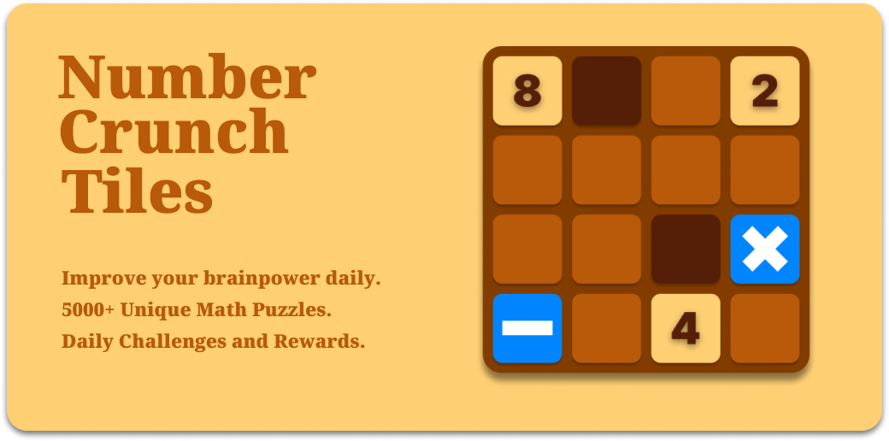

# Number Crunch Tiles

**Number Crunch Tiles** is my first published mobile game to both app stores and was a great learning experience and introduction to the Unity Gaming Engine. Working with a junior UI artist on Figma to craft a simple yet effective design and gameplay. 

## 📲 **Download Number Crunch Tiles**

- **[Download for Android](https://play.google.com/store/apps/dev?id=5076857182402717618)**
- **[Download for iOS](https://apps.apple.com/us/developer/cole-robinson/id1703674983)**

## 🛠️ **Technologies Used**

- **Unity Gaming Services**: This project introduced me to Unity Gaming Services, where I first learned to implement Auth, IAP (In-App Purchases), CloudSave, and Economy systems, giving me a foundational understanding of game services.
- **Firebase**: I gained initial experience with Firebase, learning to integrate real-time databases and backend services, which helped me build robust, scalable applications.
- **Google Analytics**: My work with Google Analytics began here, providing me with essential insights into user behavior and interaction, shaping my future optimization strategies.
- **Facebook SDK**: This project marked my first encounter with the Facebook SDK, where I learned to integrate social logins and features into a mobile game.
- **IronSource SDK**: I was introduced to ad mediation and monetization using IronSource SDK, gaining a basic understanding of how to balance revenue generation with user experience.
- **Figma**: My UI/UX journey began with Figma here, learning to design clean and simple interfaces that catered to user needs.
- **IronSource Mediation**: This project introduced me to ad mediation with IronSource, where I began to explore the possibilities of ad optimization.
- **Google Play Authentication**: I learned how to implement Google Play Authentication, gaining a basic understanding of secure user login processes.
- **Apple Game Center Authentication**: Similarly, this project was where I was introduced to Apple Game Center Auth, learning how to provide a smooth login experience for iOS users.
- **GitHub LFS**: My first experience with GitHub LFS occurred during this project, where I learned how to manage and version large game assets effectively.
- **GitHub CoPilot**: This project provided me with my initial experience using GitHub CoPilot, introducing me to AI-driven development assistance for streamlining code quality and productivity.
- **DoTween**: I learned the basics of using DoTween to animate game objects and create smooth transitions, setting the stage for more advanced animations in future projects.
- **Particle Systems**: Number Crunch Tiles introduced me to Particle Systems, where I started experimenting with basic visual effects to enhance gameplay visuals.
